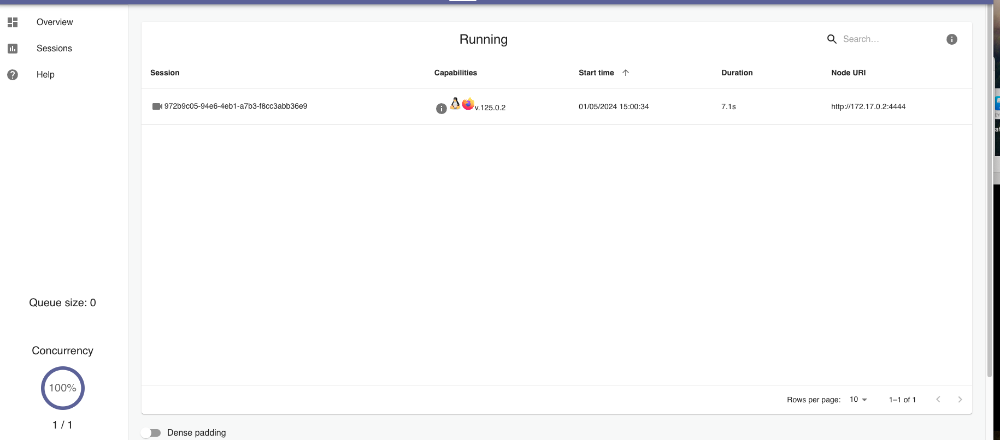
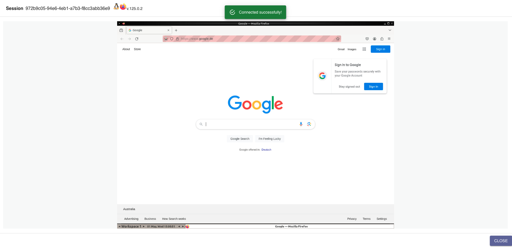
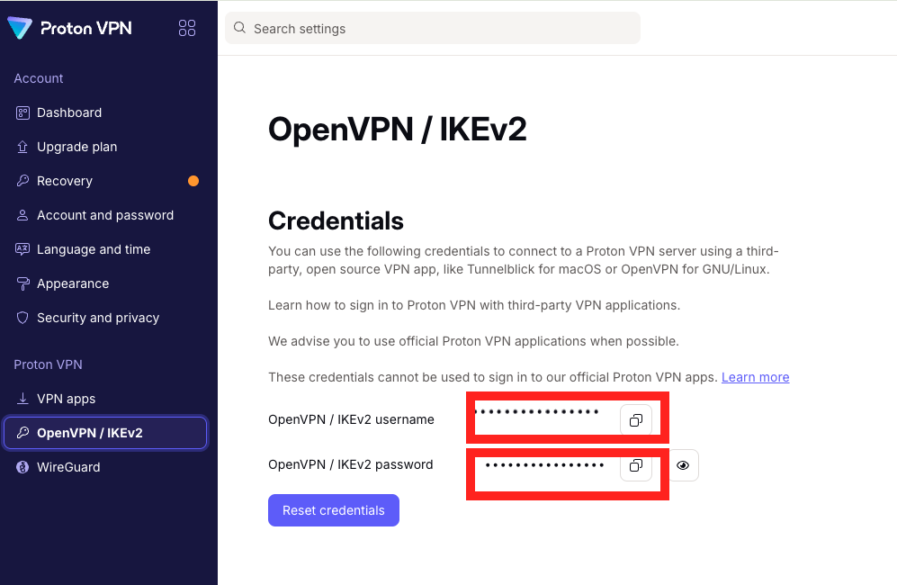

# Python Selenium Scraper #TEMPLATE

### Medium Article is here:
https://medium.com/@thoren.lederer/automate-your-web-scraping-with-docker-schedule-python-selenium-scripts-on-cron-and-watch-the-a15511701a75

### Updates
- 2024-05-13: Added Medium Article Link
- 2024-05-14: Added Tor Proxy to the Dockerfile
- 2024-05-15  Added ProtonVPN Proxy to the Dockerfile
- 2024-05-16: Added VPN Gateway bypass for local networks

## Description
<i>Disclaimer: This repository can be cloned as a template repository and modified by your needs. It is only for educational purposes.</i>

This repository contains a DockerFile with a python app to run a selenium scraper. 

You can include your own scraper logic in the `app/scraper.py` file.

The docker container will in default run every 15minutes the scraper logic. 

After the scraper is finished your data can be sent to a webhook or you can save it by your own.

## How to use
1. Clone this repository
2. Modify the `Dockerfile` Line 18 with your cronjob time
3. Modify the `app/scraper.py` file with your own scraper logic
4. (Optional: ) Modify the `app/notifier.py` file with your own notification logic
5. Build the docker container with `sh build.sh`
6. Run the docker container with `sh run.sh`

## Screenshots


<br/><br/>



## How to watch your scraper while working
You can watch your scraper while working in the browser.

URL: `http://localhost:4444`

Password: `secret`

-----

## How to modify the Cronjob default time

### Dockerfile

```
...
# modify the cronjob time here
RUN (crontab -l ; echo "*/15 * * * * /opt/scheduler.sh >> /var/log/cron/cron-scheduled.log 2>&1") | crontab

..

```

## How to use the Webhook as result
When you want to use the webhook as result you can modify the `app/notifier.py` file with your own logic.

### app/notifier.py
```

logic = LogicController(notification=WebhookNotification("http://your-webhook-url.com/api/v1/scraper"
                                                         , only_finished=True))

```

## Log files
You can find the log files in the `/var/logs/cron/cron-scheduled.log` folder.

----


## How to use the Tor Proxy
Run the run_tor.sh file to use the Tor Proxy. 
```commandline

sh run_tor.sh

```

After that you can use the tor proxy in your scraper logic. Example is included.

````python3

    ### If you want to use tor proxy, uncomment the following lines
    ff_options.set_preference('network.proxy.type', 1)
    ff_options.set_preference('network.proxy.socks', "localhost")
    ff_options.set_preference('network.proxy.socks_port', 9050)

````

## How to use the ProtonVPN Proxy

If you want to use a VPN for your scraper you can use the ProtonVPN Proxy. You can crete a free account on ProtonVPN and use the free servers.

Copy your ProtonVPN credentials from your account and run the run_protonvpn.sh file.



```commandline

sh run_protonvpn.sh

# When you are asked for the username and password, enter your ProtonVPN credentials

# basic country code is: nl

```

# How to bypass the VPN Gateway for local networks

If you want to bypass local network traffic, uncomment the lines in the change_vpn.sh file.

```commandline
    # add ignore local traffic of example for kubernetes
    # sudo bash -c "echo 'route 10.233.0.0 255.255.0.0 net_gateway' >> /etc/openvpn/client.conf"s
    # and add dns resolver if needed
    # dhcp-option DNS 10.233.0.3
```

Have fun with your scraper!

## License
[MIT](https://choosealicense.com/licenses/mit/)